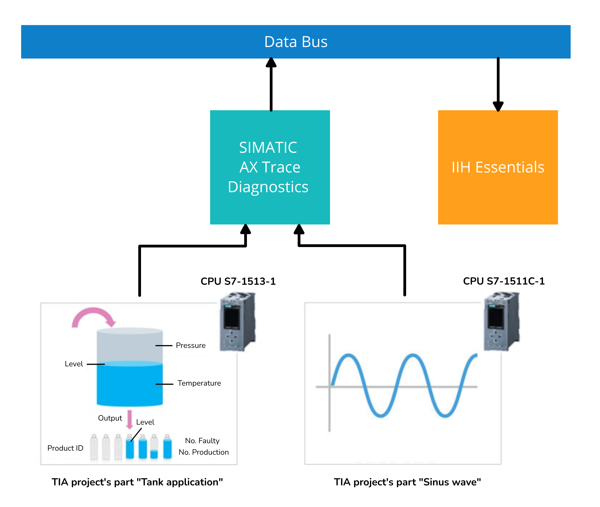

# SIMATIC AX Trace Diagnostics Getting Started

- [SIMATIC AX Trace Diagnostics Getting Started](#simatic-ax-trace-diagnostics-getting-started)
  - [Description](#description)
    - [Overview](#overview)
    - [General Task](#general-task)
  - [Requirements](#requirements)
    - [Prerequisites](#prerequisites)
    - [Used components](#used-components)
    - [Further requirements](#further-requirements)
    - [TIA Project](#tia-project)
  - [Configuration steps](#configuration-steps)
  - [Usage](#usage)

## Description

### Overview

The SIMATIC AX Trace Diagnostics is web-based application running on SIEMENS Industrial Edge used for tracing the PLC signals same way as it is done in the TIA Portal. This appication example demonstrates how to manage the connection with PLC and trace the chosen variables. 

### General task

In this application example, the connection to the PLC using this application is managed and several signals from the bottles' filling process are traced. The publishing of signals' data to Databus is also shown in this application example. Then, the signals published to Databus are read using IIH Essentials application. 

Moreover, the high speed traicing is showed. This application has an ability to trace high frequency signals. As it is explained in the Documentation, the sampling period of the signals is directly derived from the PLC's cyclic interrupt's sampling period.

## Requirements

###  Prerequisites

- Access to an Industrial Edge Management System (IEM)
- Onboarded Industrial Edge Device (IED) or Industrial Edge Virtual Device (IEVD) on IEM
- Installed System Configurator for Databus
- Installed System App Databus
- Installed Apps SIMATIC AX Trace Diagnostics and IIH Essentials
- IED in the same network as PLC (PLC is reachable from IED)
- TIA portal project (EdgeHowTos including the Tank and Sinus wave application) loaded on two PLCs (real ones or simulated using S7-PLCSIM Advanced)

### Used components

- Industrial Edge Management V1.5.2-4
  - SIMATIC AX Trace Diagnostics V1.0.2
  - Databus V2.1.0-4
  - Databus Configurator V2.0.0-4
  - IIH Essentials V1.8.0
  - Common Connector Configurator V1.8.2-3
- Industrial Edge Virtual Device V1.12.0-3-a
- TIA Portal V16
- S7-PLCSIM Advanced V3.0 Upd2
- S7-1513-1 PN
- Web browser (Google Chrome)

### Further requirements

- Databus Configurator is deployed to the IEM
- Databus is deployed to the IED

### TIA Project

The used TIA Portal project (EdgeHowTos including the Tank and Sinus wave application) can be found in the [src](src) directory under the following name and is also used for several further application examples: 

- [HowTos_Sinus_Wave.7z](docs/src/HowTos_Sinus_Wave.7z)

## Configuration steps

You can find the further information about the following steps in the [Documentation](docs/Documentation.md)

- Installation of necessary applications
- Configuration of Databus
- Managing the running PLC
- Configuration of connection to MQTT Databus
- Adding the PLC
- Adding and configuring of Trace Job
- Running the Trace Job
- Publishing the Trace Jobs to Databus
- Observing the Trace Jobs and data exporting
- Checking the published data in IIH Essentials
- Adding the second PLC and high speed sampling testing

## Usage

The application SIMATIC AX Trace Diagnostics offers the following functionalities:

- Connection to PLC via integrated S7 connector
- Definition of trace jobs
- Visualization of traced signals
- Publishing the signals' data to Databus (up to 4 signals)

  
