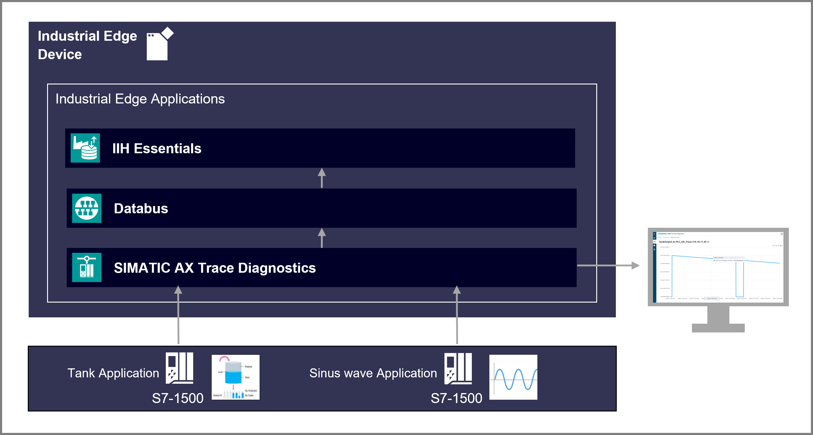

# SIMATIC  AX Trace Diagnostics Getting Started

## Description

### Overview

The SIMATIC AX Trace Diagnostics is web-based application running on SIEMENS Industrial Edge used for tracing the PLC signals same way as it is done in the TIA Portal. This appication example demonstrates how to manage the connection with PLC and trace the chosen variables. 

### General task

In this application example, the connection to the PLC using this application is managed and several signals from the bottles' filling process are traced.  The publishing of signals' data to Databus is also shown in this application example. Then, the corresponding signals are read using the Flow Creator.

It can be noticed that a high frequency noise can be traced using this application as well. It is due to the ability of this application to trace high frequency signals. Why this application can do that? As will be explained in the Configuration guide, the sampling period of the signals is directly derived from the PLC's cyclic interrupt's sampling period.

