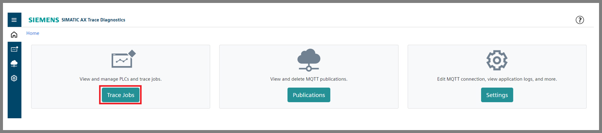

# SIMATIC AX Trace Diagnostics Getting Started: Documentation

- [SIMATIC AX Trace Diagnostics Getting Started: Documentation](#simatic-ax-trace-diagnostics-getting-started-documentation)
  - [Installation of necessary applications](#installation-of-necessary-applications)
  - [Managing the running PLC](#managing-the-running-plc)
  - [Adding the PLC](#adding-the-plc)
  - [Configuration of Databus](#configuration-of-databus)
  - [Publishing the trace jobs to databus](#publishing-the-trace-jobs-to-databus)
  - [Configuration of Flow Creator](#configuration-of-flow-creator)

## Installation of necessary applications

In order to try out the main functionalities of SIMATIC AX Trace Diagnostics application and the application example itself, the following applications should be installed on your IED or IEVD:

## Configuration of Databus

## Managing the running PLC

Download the TIA portal project (Tank application) to the PLC (real one or simulated using S7-PLCSIM Advanced) which is in the same network as your IED (or IEVD). Then, run the PLC.

## Adding the PLC (configuration of the PLC connection)

Open the application SIMATIC AX Trace Diagnostics, click on the button Trace Jobs and then on button Add PLC.

Fill the IP address of your PLC (can be different that the one in the image), nickname of your PLC (your choice, no impacts to functionality) and the password if it is used for accessing the PLC. Then, click on button Add.

If the certificate used for accessing the PLC needs to be uploaded, the Connection mode should be change from Legacy to Secure via TSL.

Then, the added PLC should be visible and its status is Online.

## Adding and running the trace jobs

Click on the button Add Trace Job.

Then, select the PLC added in previous section and write down the Job Name. Proceed with selecting the Organization Block (OB) determining the sampling period of trace job. The sampling period will be the same as cyclic time of selected OB type cyclic interrup. 

You can also lower the sampling period by typing different integer than 1 to Samplig Frequency text box. For instance, 2 means that every second sample will be taken. 

The specific Number of samples can be selected to take. The trace job ends after that. If Perpetual Job Type type is seletected, the sampling is continuous until the trace job is turned off. When the trace job is configured, click on the button Install on PLC.

In order to choose the signal for tracing, its exact TIA portal's name should be written down into Signal text box. Then, the button Add Signal should be pressed.
More signals can be also traced using one trace job.

Anothe option is providing the PLC address of the signal. 

Moreover, these two options can be combined together.

## Publishing the trace jobs to Databus

If the publishing of trace was not set during the configuration of trace job itself, it can be set afterwards by clicking on 

## Configuration of Flow Creator

