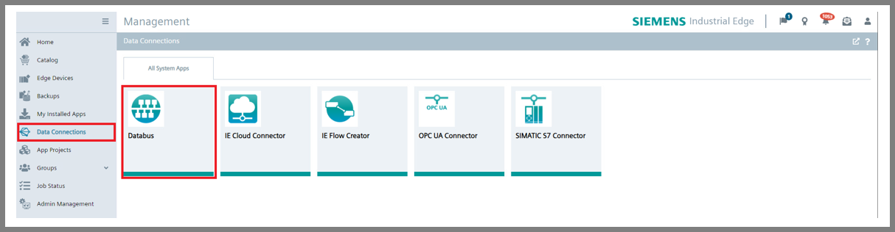
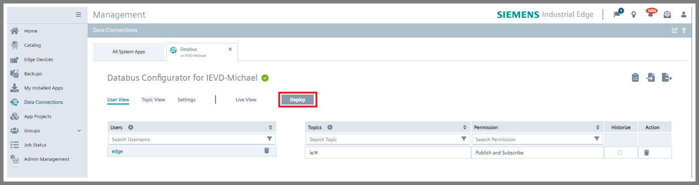
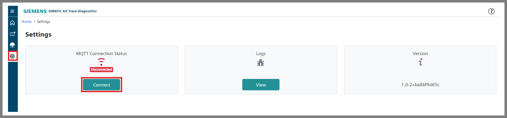
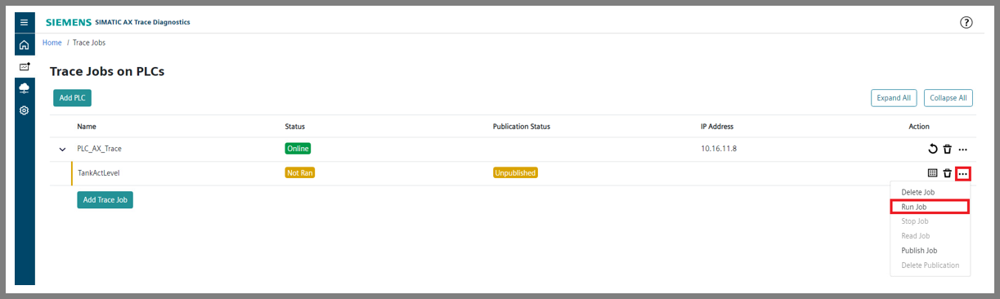
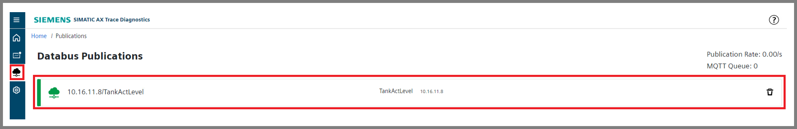

# SIMATIC AX Trace Diagnostics Getting Started: Documentation

- [SIMATIC AX Trace Diagnostics Getting Started: Documentation](#simatic-ax-trace-diagnostics-getting-started-documentation)
  - [Installation of necessary applications](#installation-of-necessary-applications)
  - [Configuration of Databus](#configuration-of-databus)
  - [Managing the running PLC](#managing-the-running-plc)
  - [Configuration of connection to MQQT Databus](#configuration-of-connection-to-mqtt-databus)
  - [Adding the PLC](#adding-the-plc)
  - [Adding and configuring of Trace Job](#adding-and-configuring-of-trace-job)
  - [Running the Trace Job](#running-the-trace-job)
  - [Publishing the Trace Jobs to Databus](#publishing-the-trace-jobs-to-databus)
  - [Observing the Trace Jobs and data exporting](#observing-the-trace-jobs-and-data-exporting)
  - [Configuration of Flow Creator](#configuration-of-flow-creator)

## Installation of necessary applications

In order to try out the main functionalities of SIMATIC AX Trace Diagnostics application and the application example itself, the following applications should be installed on your IED or IEVD:

## Configuration of Databus

In your IEM go to the Data Connections and open the Databus. Add a user with following topic: `"ie/#"` and deploy it to IED.

## Managing the running PLC

Download the TIA portal project (Tank application) to the PLC (real one or simulated using S7-PLCSIM Advanced) which is in the same network as your IED (or IEVD). Then, run the PLC. 

The HMI interface can be also downloaded/simulated for better understanding of demo Tank application workflow. 

## Configuration of connection to MQTT Databus

Open the application SIMATIX AX Trace Diagnostics, go to the Settings and then click on the button Edit under the MQTT Connection Status. 

Then, configure the MQTT Databus Address, Port Number, Username and Password and click on the button Connect.

When this configuration is done, the MQTT Connection Status should be Connected. 

## Adding the PLC (configuration of the PLC connection)

Click on the button Trace Jobs and then on the button Add PLC.

Fill the IP address of your PLC (can be different that the one in the image), nickname of your PLC (your choice, no impacts to functionality) and the password if it is used for accessing the PLC. Then, click on the button Add.

If the certificate used for accessing the PLC needs to be uploaded, the Connection mode should be change from Legacy to Secure via TSL.

Then, the added PLC should be visible and its status is Online.

## Adding and configuring the Trace Job

Click on the button Add Trace Job.

Then, select the PLC added in previous section and write down the Job Name. Proceed with selecting the Organization Block (OB) determining the sampling period of trace job. The sampling period will be the same as cyclic time of selected OB type cyclic interrup. In case of Tank application use in this application example, the OB "Cyclic interrupt" is used.

You can also lower the sampling period by typing different integer than 1 to Samplig Frequency text box. For instance, 2 means that every second sample will be taken. 

The specific Number of samples can be selected to take. The trace job ends after that. If Perpetual Job Type type is seletected, the sampling is continuous until the trace job is turned off. 

In order to choose the signal for tracing, its exact TIA portal's name should be written down into Signal text box. Then, the button Add Signal should be pressed.
More signals can be also traced using one trace job.

Anothe option is providing the PLC address of the signal. 

Moreover, these two options can be combined together.

When the Trace Job is configured, click on the button Install on PLC.

Here is the table of proposed process values for tracing:

| TIA portal's Name  | PLC address | Description | Proposed Trace Job's name |
| ------------- | ------------- | ------------- | ------------- |
| GDB.signals.tankSignals.actLev  | %DB1.DBD94  | actual level of tank in liters | TankActLevel |
| GDB.signals.tankSignals.actTemperature  | %DB1.DBD94  |  actual temparature in tank in degrees Celsius | TankActTemp |
| GDB.signals.tankSignals.actPressure  | %DB1.DBD100  | actual pressure in tank in hectopascals | TankActPress |
| GDB.signals.bottleSignals.outputTank  | %DB1.DBD116  | actual outflow from tank in liters per minute  | TankOutput |
| GDB.signals.bottleSignals.actLevel  | %DB1.DBD110  | actual level of filling bottle in liters | BottleLevel |

## Running the Trace Job

When the Trace Job is configured correctly and added, it can be run by clicking on the meatballs menu and then on the button Run Job.

## Publishing the Trace Jobs to Databus

If the publishing of trace was not set during the configuration of the Trace Job, it can be set afterwards by clicking on the meatballs menu and then on the button Publish Job.

In the next window, the option of publishing only the changes to Databus can be selected. For continuos publishing, this checkbox should be left unchecked. Then, click on the button Publish. 

The publication to Databus can be deleted by clicking to the button Delete Publication in meat beals menu in corresponding Trace Job. 

In order to see the overview of Databus publications, go the Databus Publications.

Here the Databus publication can be deleted as well.

The maximum of published Trace Jobs to databus is four.

## Observing the Trace Jobs and data exporting

