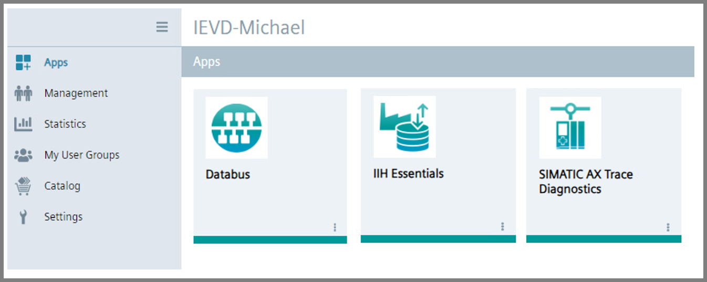

# SIMATIC AX Trace Diagnostics Getting Started: Documentation

- [SIMATIC AX Trace Diagnostics Getting Started: Documentation](#simatic-ax-trace-diagnostics-getting-started-documentation)
  - [Installation of necessary applications](#installation-of-necessary-applications)
  - [Managing the running PLC](#managing-the-running-plc)
  - [Adding the PLC](#adding-the-plc)
  - [Configuration of Databus](#configuration-of-databus)
  - [Publishing the trace jobs to databus](#publishing-the-trace-jobs-to-databus)
  - [Configuration of Flow Creator](#configuration-of-flow-creator)

## Installation of necessary applications

In order to try out the main functionalities of SIMATIC AX Trace Diagnostics application and the application example itself, the following applications should be installed on your IED or IEVD:

## Managing the running PLC

## Adding the PLC (configuration of the PLC connection)

Open the application SIMATIC AX Trace Diagnostics, click on button Trace Jobs and then on button Add PLC.

## Adding and running the trace jobs

## Configuration of Databus

## Publishing the trace jobs to databus

## Configuration of Flow Creator

